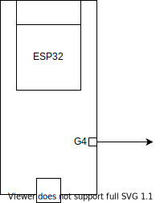

# NMEA Fuel-flow Sensor

This repository holds the software and documentation for the onboard fuel-flow instrumentation of our
Touring Motor Glider D-39.

## Concept



The actual sensor outputs a square wave whose frequency corresponds to fuel-flow.

We use a ESP32 to read the sensor and present the data as an NMEA-Sentence over Bluetooth LE.

The sentence is of the form `$PFLO,xxx.x*??`, where xxx.x is the number of ticks per second and ?? the checksum.

Our calibration factor is 8600 ticks per liter.

## Setup Build Environment

* zephyr development environment setup as described in https://docs.zephyrproject.org/1.14.0/getting_started/installation_linux.html
* install esp32 specific toolchan as described in https://docs.zephyrproject.org/latest/boards/xtensa/esp32/doc/index.html

## Build Application

Create a build folder and run cmake before building the application using ninja.

```bash
mkdir build && cd build
cmake -GNinja ..
ninja
```

## Flash Application

Assuming esp32 is connected via /dev/ttyUSB0 use

```bash
ninja flash
```

Otherwise the esp device path has to be set during build.

## Alternative Flashing

[esptool.py](https://github.com/espressif/esptool) can be used to flash the firmware. Install it by

``` bash
pip install esptool
```

and use the following command to flash our binary

``` bash
esptool.py --chip esp32 --port /dev/ttyUSB0 --baud 460800 write_flash -z 0x10000 zephyr.bin
```

## Build and run tests

Tests are contained in the subfolder test as separate zephyr application. By default this application runs on qemu-arm-m3. Build Instructions can be found in test/README.md.
